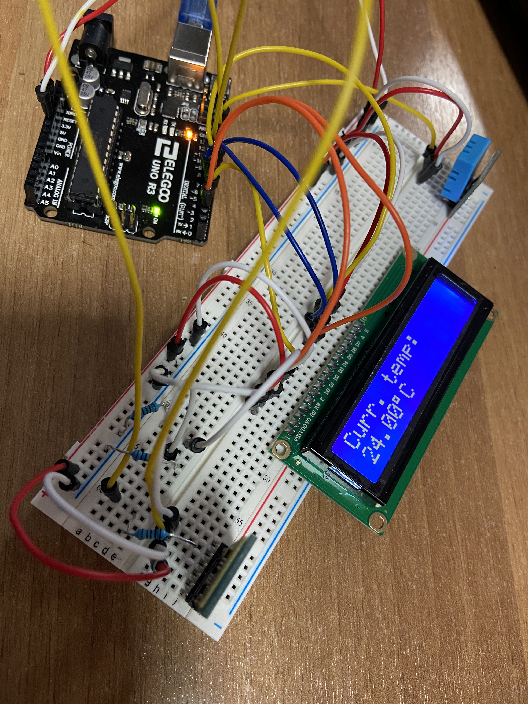
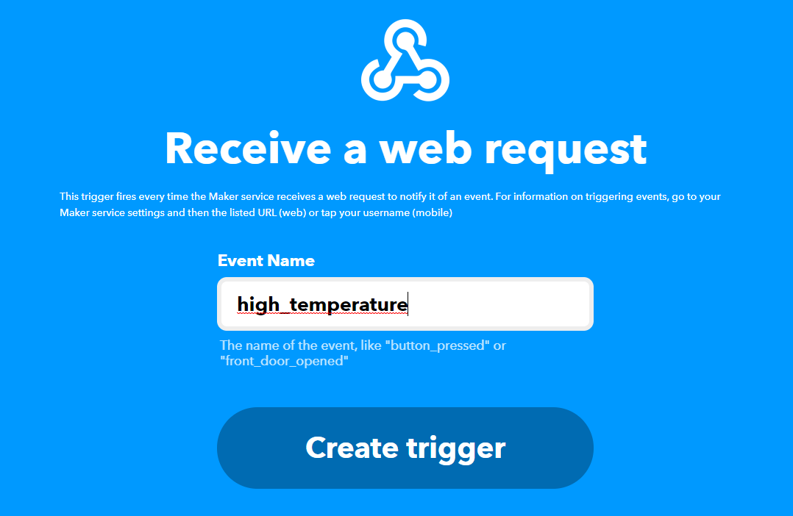
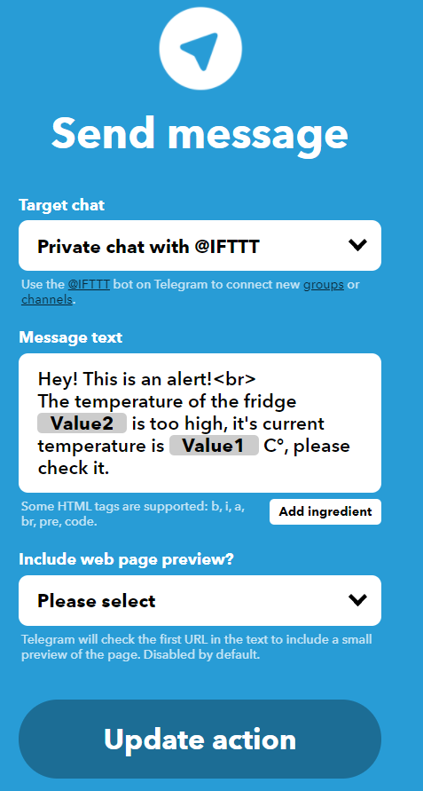

# Cold Room Smart Meter 



## Summary

[1. Introduction](#Introduction): Problem and a possible solution<br>
[2. Architecture](#Architecture): Project Architecture<br>
[3. Project Structure](#Project-Structure): Project Structure
[4. Getting started](#Getting-Started): Guide to run the project

## Introduction

This is a project for the exam of ***Serverless Computing for IoT***.<br>
The focus of this project start from the need by the big market or restaurant, that have a lot of cold room, to continuously control them in order to guarantee the food freshness and the customers healthy.<br>
Actually this task is performed manually by an employee; and this could cause an effort for the big companies.<br>In order to reduce the effort on the work place, we can automatically detect the temperature inside the room by introducing a temperature sensor and then alert the employee if something is going wrong.

## Architecture
Here's a resume of the architecture used for the project:


Since I haven't the wireless module on Arudino, I have executed a Python script that, for each device read the data related to the current temperature and then Publish this value on the relative channel with QoS set to 0.<br><br>
MQTT Broker ([RabbitMQ](https://www.rabbitmq.com/)) is executed over the [Docker](https://www.docker.com/) container in order to easily deploy it in production. Each time a device publish a new value, a [Nuclio](https://nuclio.io/) function is invoked using a RabbitMQ trigger that works as subs over the topic of all the cold room sensors, using the relative wildcard.<br><br>
Nuclio function ([handler.js](Function/handler.js)) check the recieved value, if it is higher than the max_temperature, it execute an HTTP request to the [IFTTT](https://ifttt.com) WebHook that sends an alert message (containing the current temperature) on [Telegram](https://telegram.org/).

## Project Structure
- Function
  - **handler.js**: contains the Nuclio function, that is executed when a new value has been published;
  - **yaml/temperaturereader.yaml**: contains all the deploying informations of the function on nuclio;
- Initializer
  - **config.json**: contains the parameters for configure the sensors (serial port, max allowed temperature and fridge name);
  - **initReader.py**:  read the infos contained into config.json file and execute a thread for each device;
  - **mqtt_config.json**: contains the parameter for configure the connection between client and broker;
  - **SerialReaderThread.py**: read the value from the serial port and publish the value on the relative channel.
  
## Getting Started

### Docker
Install [Docker](https://www.docker.com) using the Docker CE installation [guide](https://docs.docker.com/install/linux/docker-ce/ubuntu/#extra-steps-for-aufs).

```sh
$ sudo apt-get update
$ sudo apt-get install \
    apt-transport-https \
    ca-certificates \
    curl \
    gnupg \
    lsb-release
$ curl -fsSL https://download.docker.com/linux/ubuntu/gpg | sudo gpg --dearmor -o /usr/share/keyrings/docker-archive-keyring.gpg
$ echo \
  "deb [arch=amd64 signed-by=/usr/share/keyrings/docker-archive-keyring.gpg] https://download.docker.com/linux/ubuntu \
  $(lsb_release -cs) stable" | sudo tee /etc/apt/sources.list.d/docker.list > /dev/null
$ sudo apt-get update
$ sudo apt-get install docker-ce
```

------------------------------------------------------------------------------------------------------------------------------

### Docker Compose

Install Docker Compose using the Docker Compose installation [guide](https://docs.docker.com/compose/install/#install-compose).

```sh
$ sudo curl -L "https://github.com/docker/compose/releases/download/1.22.0/docker-compose-$(uname -s)-$(uname -m)" -o /usr/local/bin/docker-compose
$ sudo chmod +x /usr/local/bin/docker-compose
```

----------------------------------------------------------------------------------------------------------------------------


### Nuclio 
Start [Nuclio](https://github.com/nuclio/nuclio) using a docker container.

```sh
$ docker run -p 8070:8070 -v /var/run/docker.sock:/var/run/docker.sock -v /tmp:/tmp nuclio/dashboard:stable-amd64
```

Browse to http://localhost:8070.

----------------------------------------------------------------------------------------------------------------------------

### RabbitMQ 

Start [RabbitMQ](https://www.rabbitmq.com) instance with MQTT enabled using docker.

```sh
$ docker run -p 9000:15672  -p 1883:1883 -p 5672:5672  cyrilix/rabbitmq-mqtt 
```

Browse to http://localhost:9000. The default username is ***guest***, and the password is ***guest***

------------------------------------------------------------------------------------------------------------------------------
### IFTTT
Register on [IFTTT](https://ifttt.com) and [create a new applet](https://ifttt.com/create) by adding on IF clause WebHooks service > Receive a web request with the following parameter:



and with a THEN clause Telegram > Send Message with the following parameters:



Once done, by going into WebHook documentation you can find your event_key, that you need to put inside the [nuclio handler function](Function/handler.js).

------------------------------------------------------------------------------------------------------------------------------
### Python 3.7
In order to execute the reader you need Python 3.7, if you haven't Python, you need to install it. <br>
Install [Python](https://www.python.org/) with the relative dependencies.

```sh
$ sudo apt install python3.7
$ pip install paho-mqtt serial
```
### Parameters
In order to execute Python script (since Arduino isn't equipped of wireless module) you need to set the following parameters:
- For each sensor ([config.json](Initializer/config.json)), following the JSON syntax:
  - ***port***: the serial port used for the communication between Arduino and PC;
  - ***maxTemperature***: the maximum allowed temperature for the fridge;
  - ***fridgeName***: the name of the fridge.
  
- RabbitMQ broker ([mqtt_config.json](Initializer/mqtt_config.json)), following the JSON syntax:
  - ***ip***: address of the broker (localhost if local);
  - ***port***: port of the broker (usually 1883);
  - ***username***: user used for the authentication (usually guest);    
  - ***password***: psw used for the authentication (usually guest).

------------------------------------------------------------------------------------------------------------------------------

- **Update and deploy Functions**:
- Type '**localhost:8070**' on your browser to open the homepage of Nuclio
- Create new project
- Press '**Create function**', '**Import**' and upload the function that are in the **Function/Yaml** folder
- In both, **change the already present [parameters](#parameters) with yours** (in particular for the event_key generated from IFTTT\
**⚠️Remember to change the trigger parameters too.⚠️**
- Press **'Deploy'**.


------------------------------------------------------------------------------------------------------------------------------
### Execute script
If pip is not installed, install it:
```sh
$ sudo apt-install python3-pip
```
Then, install the required dependencies:
```sh
$ pip install pyserial
$ pip install paho-mqtt
```
Start script
```sh
$ py3 initReader.py
```