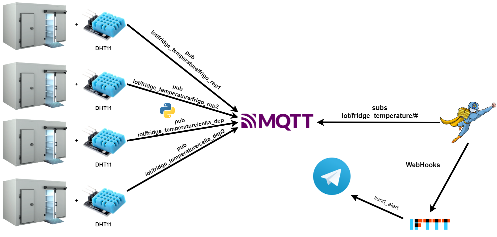

# Cold Room Smart Meter 

## Summary

[1. Introduction](#Introduction): Problem and a possible solution 
[2. Architecture](#Architecture): Project Architecture

## Introduction

This is a project for the exam of ***Serverless Computing for IoT***. 
The focus of this project start from the need by the big market or restaurant, that have a lot of cold room, to continuously control them in order to guarantee the food freshness and the customers healthy. 
Actually this task is performed manually by an employee; and this could cause an effort for the big companies. In order to reduce the effort on the work place, we can automatically detect the temperature inside the room by introducing a temperature sensor and then alert the employee if something is going wrong.

## Architecture
Here's a resume of the architecture used for the project:

Since I haven't the wireless module on Arudino, I have executed a Python script that, for each device read the data related to the current temperature and then Publish this value on the relative channel with QoS set to 0.  
MQTT Broker ([RabbitMQ](https://www.rabbitmq.com/)) is executed over the [Docker](https://www.docker.com/) container in order to easily deploy it in production. Each time a device publish a new value, a [Nuclio](https://nuclio.io/) function is invoked using a RabbitMQ trigger that works as subs over the topic of all the cold room sensors, using the relative wildcard.  
Nuclio function ([handler.js](Function/handler.js)) check the recieved value, if it is higher than the max_temperature, it execute an HTTP request to the [IFTTT](https://ifttt.com) WebHook that sends an alert message (containing the current temperature) on [Telegram](https://telegram.org/).